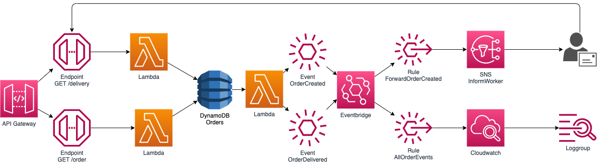

# Workshop event-driven architecture with AWS CDK

Example application of an event-driven aws serverless architecture biuld with aws cdk.

## Architecture

## Features

- Every get request to `/order` generates an item in the database
- each change in the database is triggering a lambda that checks the database change and then publish a event with the order details and a url for email reviever to confirm the delivery
- a event rule forwards all order events to a SNS topic which sents an email to the configured email address (maybe check spam folder)
- once the user click the link in the email the second apigateway endpoint is triggered which updates the status in the database
- all events are logged to a loggroup

## Useful commands

- `npm run deploy` deploy this stack to your AWS account/region
- `npm run deploy:no-approval` deploy this stack to your AWS account/region without beeing asked for approval
- `npm run diff` compare deployed stack with current state
- `npm run synth` emits the synthesized CloudFormation template
